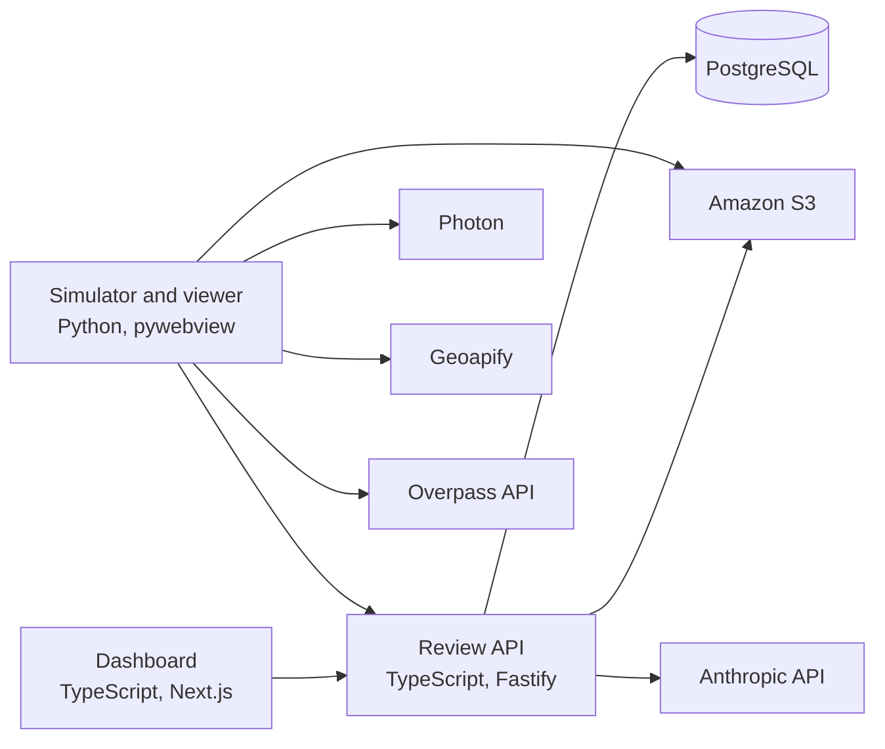

# Canopy

Canopy is a drone swarm simulator that maps a procedurally generated house, or one built from a real address, finds the electric meter, and decides where a home battery can go. A Python pipeline flies the simulated drones in a desktop three.js viewer and uploads each run's photos and video to a TypeScript review API, which stores them in PostgreSQL and S3 and serves them to a Next.js dashboard for review.

